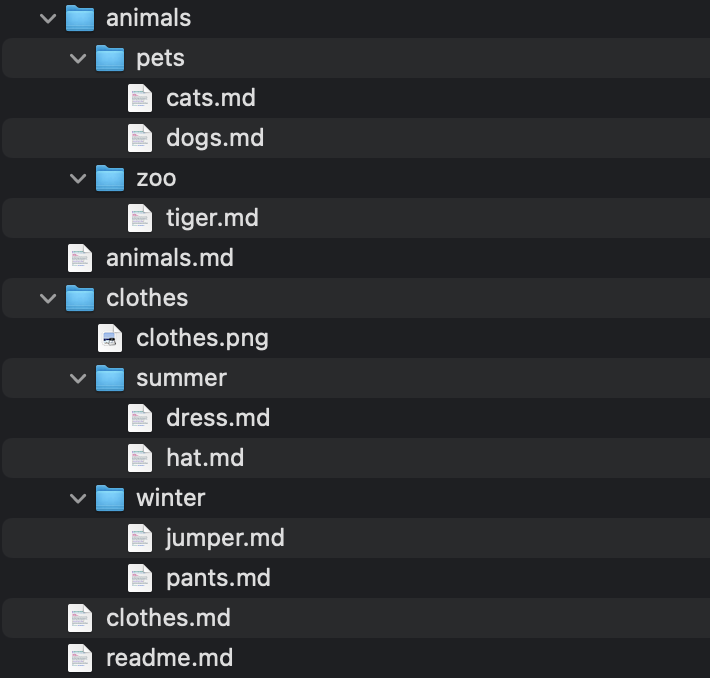

# MarkdownChildrenKit

<p align="center">
    
    <br>
    <a href="https://swiftpackageindex.com/ptrkstr/MarkdownChildrenKit"></a>
    <a href="https://swiftpackageindex.com/ptrkstr/MarkdownChildrenKit"></a>
    <br>
    <a href="https://github.com/apple/swift-package-manager" alt="MarkdownChildrenKit on Swift Package Manager"></a>
    <a href="https://github.com/ptrkstr/MarkdownChildrenKit/actions/workflows/swift.yml"></a>
    <a href="https://codecov.io/gh/ptrkstr/MarkdownChildrenKit"></a>
    <br>
    Generates a markdown list of children files and folders and saves it to a markdown file.<br>
    Useful when wanting an index in a readme.md.<br>
    <a href="https://github.com/ptrkstr/MarkdownChildren">Available as a command line tool here.</a>
</p>

## Example
GIVEN a readme.md file exists

```markdown
My favourite things are:
<!-- markdown-children:start -->
<!-- markdown-children:end -->
```

<details>
	<summary>AND it's in this directory</summary>
	

</details>

<details>
	<summary>WHEN MarkdownChildrenKit is invoked</summary>
	
```swift
try MarkdownChildren().process(.init(
    url: URL(string: "../readme.md",
    nameType: .useH1,
    tagStart: "<!-- markdown-children:start -->",
    tagEnd: "<!-- markdown-children:end -->",
    saver: saver
))
``` 
</details>

THEN the readme.md turns into:

```markdown
My favourite things are:
<!-- markdown-children:start -->
- [Animals](animals.md)
- animals
  - pets
    - [Cats](animals/pets/cats.md)
    - [Dogs](animals/pets/dogs.md)
  - zoo
    - [Tiger](animals/zoo/tiger.md)
- [Clothes](clothes.md)
- clothes
  - summer
    - [Dress](clothes/summer/dress.md)
    - [Hat](clothes/summer/hat.md)
  - winter
    - [Jumper](clothes/winter/jumper.md)
    - [Pants](clothes/winter/pants.md)
<!-- markdown-children:end -->
```


## Installation

### SPM
Add the following to your project:  
```
https://github.com/ptrkstr/MarkdownChildrenKit
```

## TODO

- [ ] Option - Choose list node (`-`, `*` or `+`)
- [ ] Option - Skip folder if it doesn't contain any markdown files
